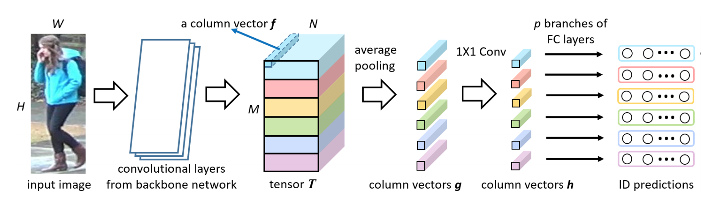
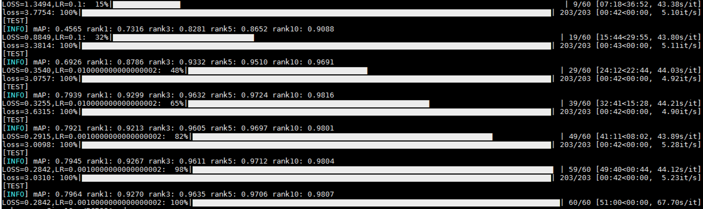
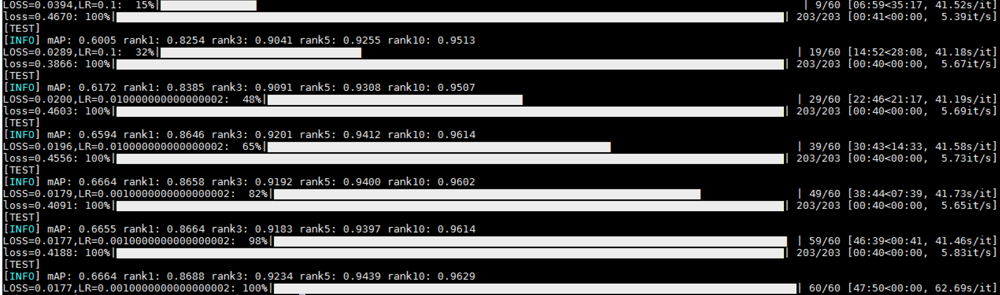
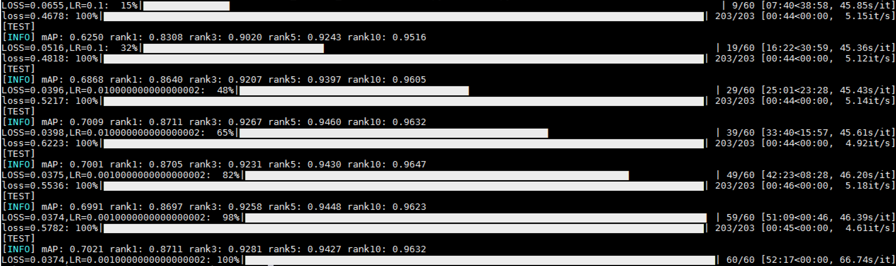

# Person_ReID
Beyond Part Models: Person Retrieval with Refined Part Pooling
(and A Strong Convolutional Baseline)

https://arxiv.org/pdf/1711.09349.pdf

|         | mAP    |  R-1  | R-5  |R-10  |
| --------| -----: | :----:|:----:|:----:|
| Paper   |   77.3 |   92.4| 97   |97.9  |
| Reproduce| 79.6  |   92.7|97.0  |98.1  |
| SF+SC   | 66.6     |   86.9   |94.4|96.3|
| SC      | 70.2     |   87.1   |94.3|96.3|
--------------------- 
SC:Shared feature extraction  
SF:Sharing the classifier part, features are cat together

Reproduce 

SF+SC  

SC  

